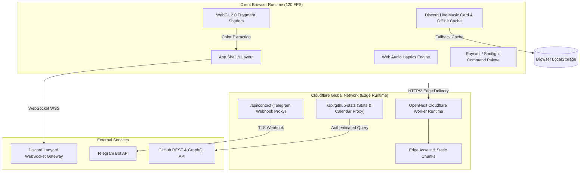

<div align="center">

# balajitechlab.com

**The Personal Engineering Lab & Production Showcase of Balaji S. (`balajitechlabs`)**  
*Principal Android Architect, Systems Engineer & Full-Stack Developer &mdash; Bengaluru, India 🇮🇳*

[](https://balajitechlab.com)
[-black?style=flat-square&logo=next.js)](https://nextjs.org/)
[](https://react.dev/)
[](https://www.typescriptlang.org/)
[](https://github.com/balajitechlabs/balajitechlab.com/actions/workflows/ci.yml)
[](https://github.com/balajitechlabs/balajitechlab.com/actions/workflows/security.yml)
[-success?style=flat-square)](https://github.com/balajitechlabs/balajitechlab.com/security/dependabot)
[](LICENSE)

[**Live Application**](https://balajitechlab.com) &bull; [**QuickDash**](https://quickdash.balajitechlab.com) &bull; [**macOS Setup Showcase**](https://balajitechlab.com/macos) &bull; [**GitHub Profile**](https://github.com/balajitechlabs)

</div>

---

## 🏛️ System Architecture

`balajitechlab.com` is engineered as a zero-latency, edge-rendered developer workstation running on **Cloudflare Workers** via the **OpenNext Next.js 16** compilation engine. It integrates client-side WebGL fragment shaders, a real-time Discord presence gateway, synthesized Web Audio haptics, and a keyboard-driven command palette.



---

## ⚡ Core Engineering Subsystems

### 1. 🎵 Real-Time Discord Gateway & Offline Playback Sync
* **Gateway Connection**: Persistent WebSocket connection to the Lanyard presence daemon (`wss://api.lanyard.rest/socket`) tracking Spotify and custom Discord rich presence applications (`BTL Music`, `ArchiveTune`, `Apple Music`).
* **Multi-Tier Asset Resolution**: Resolves track art across Spotify CDNs, Discord attachment proxies (`mp:attachments/`), and raw Discord application asset hashes (`cdn.discordapp.com/app-assets/{app_id}/{asset}.png`).
* **Offline-First State Engine**: Caches playback state in `localStorage`. When the user is inactive or offline, the widget renders a relative time badge (`LAST PLAYED · 15m ago`) with cached album art and state indicators.
* **Universal Destination**: Universal click routing to [`github.com/balajitechlabs/discord-music-card`](https://github.com/balajitechlabs/discord-music-card).

### 2. 🎨 Hardware-Accelerated WebGL Shaders & Dynamic Theming
* **GPU Fragment Shaders**:
  * **AMOLED Topographic**: Procedural Perlin noise contour isolines with pitch-black OLED background cutoff.
  * **The Universe Within**: 3D neural constellation network with dynamic star clustering.
  * **Voronoi Distances**: Euclidean cell geometry and distance fields.
* **Adaptive Contrast & Color Extraction**: Dynamically calculates dominant hue coordinates from shader uniforms and adapts CSS variables (`--primary-color`, typography shadows) to guarantee WCAG AAA text contrast across theme switches.
* **Device Economy**: Auto-scales viewport render scale (DPR clamping) on low-power devices and halts draw loops when out-of-viewport via `IntersectionObserver`.

### 3. ⌨️ Spotlight / Raycast Command Palette (`cmdk`)
* **Global Access**: Accessible via `Cmd + K` (macOS), `Ctrl + K` (Linux/Windows), or `/`.
* **Instant Actions**: Live shader selection, direct deep-link navigation, contact trigger, resume downloads, sound effect toggles, and clipboard copy utilities.

### 4. 🔊 Synthesized Web Audio Haptics (`soundFx.ts`)
* Zero external audio assets; sounds are synthesized programmatically using the browser `AudioContext` and oscillator nodes (frequencies, exponential decay gains, pop chords).

### 5. 🛡️ Hardened Edge API Proxies
* **Telegram Contact Gateway (`/api/contact`)**: Dispatches HTML-formatted notification payloads directly to the admin Telegram channel via authenticated bot token.
* **GitHub Stats Gateway (`/api/github-stats`)**: Aggregates live repository stats, star counts, and contribution calendar metrics with server-side rate-limit caching.

---

## 📂 Repository Structure

```text
balajitechlab.com/
├── .github/
│   ├── workflows/
│   │   ├── ci.yml                 # Pinned CI pipeline (Typecheck, Lint, Build)
│   │   ├── security.yml           # CodeQL SAST vulnerability scanning (v4)
│   │   └── update-project-details.yml # Automated midnight repo stats sync
│   ├── ISSUE_TEMPLATE/            # Form-based issue templates
│   ├── CODE_OF_CONDUCT.md         # Contributor Covenant standard
│   ├── CONTRIBUTING.md            # Clean code & conventional commit guidelines
│   └── SECURITY.md                # Vulnerability disclosure protocol
├── public/
│   ├── assets/img/                # Static brand logos and showcase media
│   └── project-details.json       # Cached project metadata & download counters
├── src/
│   ├── app/
│   │   ├── api/                   # Edge API route handlers (contact, stats)
│   │   ├── macos/                 # macOS developer setup showcase page
│   │   ├── layout.tsx             # Root layout with splash screen & fonts
│   │   └── page.tsx               # Home landing & hero engine
│   ├── components/                # Modular React 19 UI components
│   │   ├── DiscordMusicWidget.tsx # Real-time Discord presence & offline player
│   │   ├── DeveloperPalette.tsx   # cmdk Spotlight command palette
│   │   ├── LoadingScreen.tsx      # AMOLED hardware-accelerated splash screen
│   │   └── *Background.tsx        # WebGL shader renderers
│   ├── lib/                       # Utility libraries (soundFx, releaseNotes)
│   └── styles/                    # Scoped component and layout stylesheets
├── open-next.config.ts            # Cloudflare OpenNext compilation profile
├── wrangler.jsonc                 # Cloudflare Worker edge configuration
└── package.json                   # Dependencies (Next 16.3, React 19, pnpm 10)
```

---

## 🛠️ Local Development & Build

### Prerequisites
* **Node.js**: `v20.x` or `v24.x`
* **pnpm**: `v10.6.2` (enforced via `packageManager`)

### Installation & Run
```bash
# 1. Clone the repository
git clone https://github.com/balajitechlabs/balajitechlab.com.git
cd balajitechlab.com

# 2. Install dependencies
pnpm install

# 3. Configure environment secrets
cp .env.example .env.local
# Add your GITHUB_TOKEN, TELEGRAM_BOT_TOKEN, TELEGRAM_CHAT_ID

# 4. Start development server with Turbopack
pnpm dev
```

### Verification & Quality Checks
```bash
# TypeScript compiler check (0 errors)
pnpm exec tsc --noEmit

# ESLint check (0 errors, 0 warnings)
pnpm run lint

# Production Next.js Turbopack build
pnpm run build

# Cloudflare OpenNext bundle verification
pnpm run build:cf

# Dependency security audit (0 vulnerabilities)
pnpm audit
```

---

## 🚀 Cloudflare Edge Deployment

The production deployment builds via `@opennextjs/cloudflare` into an optimized single worker bundle:

```bash
# Build OpenNext worker and static asset bundle
pnpm run build:cf

# Deploy worker to Cloudflare Edge
npx wrangler deploy
```

---

## 📜 License & Copyright

Distributed under the **MIT License**. See [`LICENSE`](LICENSE) for complete terms.

Copyright &copy; 2026 **||BTL||™ (balajitechlabs)**. All Rights Reserved.
